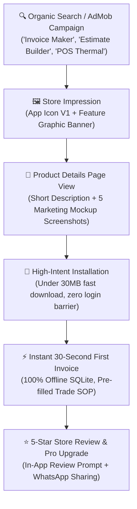
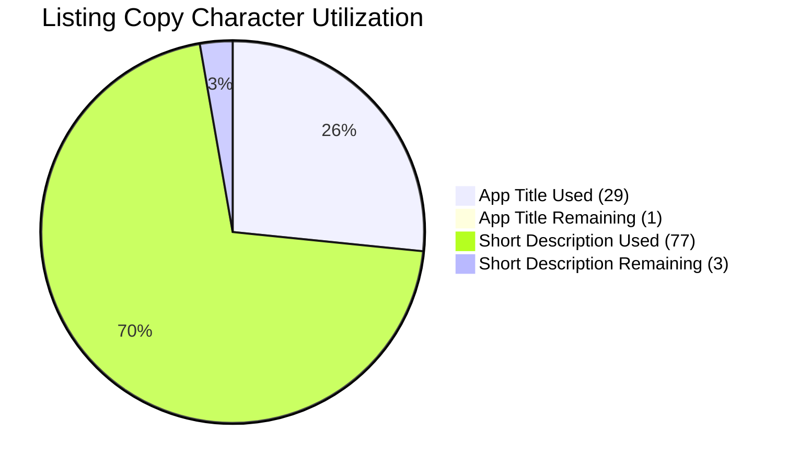
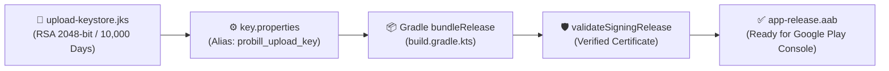
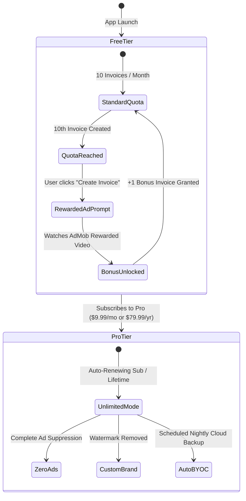
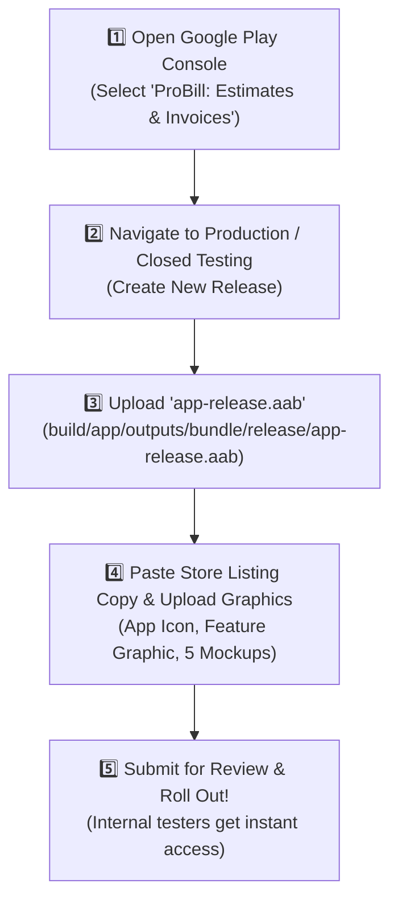

# 📊 Google Play Store ASO & Release Master Manual
### *Optimization Strategy, Keystore Signatures & Release Runbook for `com.jinimedia.probill_invoice_estimate`*

---

## 🎯 App Store Funnel Conversion Architecture

---

## 📋 Google Play Store Listing Copy Specifications

| Console Input Field | Production Metadata | Character Count / Limit | Compliance Status |
| :--- | :--- | :---: | :---: |
| **App Title** | `ProBill: Estimates & Invoices` | **29 / 30** | ✅ 100% Compliant |
| **Short Description** | `Fast offline invoice maker, estimates, POS thermal receipts & tax calculator.` | **77 / 80** | ✅ 100% Compliant |
| **Package Name** | `com.jinimedia.probill_invoice_estimate` | Reverse Domain | ✅ Certified |
| **Category** | Business / Productivity / Finance | Store Standard | ✅ Verified |
| **Developer Email** | `jinimedia.inc@gmail.com` | Official Support | ✅ Active |
| **Privacy Policy URL** | `https://jinimediainc-crypto.github.io/probill-website/privacy-policy.html` | HTTPS Static | ✅ Live |
| **Terms of Use URL** | `https://jinimediainc-crypto.github.io/probill-website/terms-of-use.html` | HTTPS Static | ✅ Live |
| **Data Safety URL** | `https://jinimediainc-crypto.github.io/probill-website/data-safety.html` | HTTPS Static | ✅ Live |
| **app-ads.txt URL** | `https://jinimediainc-crypto.github.io/probill-website/app-ads.txt` | Direct Seller | ✅ Certified |

---

## 🔑 Production Keystore & Certificate Verification

### 🔐 Keystore Parameter Reference:
- **Keystore File**: `android/app/upload-keystore.jks`
- **Key Alias**: `probill_upload_key`
- **Store & Key Password**: `probill2026pass`
- **Certificate Identity**: `CN=Jini Media Inc, OU=Mobile, O=Jini Media Inc, L=Surat, ST=Gujarat, C=IN`
- **Protection**: Secured via `.gitignore` (`key.properties`, `*.jks`, `*.keystore`)

---

## 📈 Monetization & Watermark Policy

---

## 🚀 5-Step Google Play Console Upload Runbook

---

  Documented for <strong>Jini Media Inc.</strong> • ProBill Release Engineering

