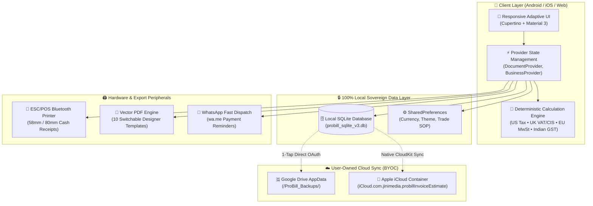
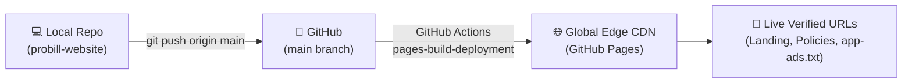

<div align="center">

# ⚡ ProBill: Estimates & Invoices
### *High-Performance Offline Invoicing, Estimate Builder & POS Suite*

[](https://flutter.dev)
[](https://sqlite.org)
[](https://play.google.com)
[](https://jinimediainc-crypto.github.io/probill-website/)

---

### 🌐 Official Web Portal & Compliance Hub
**[Live Web Portal](https://jinimediainc-crypto.github.io/probill-website/)** • **[Privacy Policy](https://jinimediainc-crypto.github.io/probill-website/privacy-policy.html)** • **[Terms of Use](https://jinimediainc-crypto.github.io/probill-website/terms-of-use.html)** • **[Data Safety](https://jinimediainc-crypto.github.io/probill-website/data-safety.html)** • **[app-ads.txt](https://jinimediainc-crypto.github.io/probill-website/app-ads.txt)**

</div>

---

## 🏛️ System Architecture Topology



---

## 🌟 Core Feature Matrix

| Feature | Free Forever Starter | Pro Tier Unlimited | Technical Implementation |
| :--- | :---: | :---: | :--- |
| **Document Creation** | 10 / Month | **Unlimited ⚡** | SQLite Transaction Engine |
| **Trade Catalogues** | 34+ Trade SOP Presets | **34+ Trade SOP Presets** | Instant JSON Seed Loader |
| **Privacy & Storage** | 100% Local SQLite | 100% Local SQLite | AES-256 Checksum Encryption |
| **Ad Experience** | Non-intrusive AdMob | **100% Ad-Free (0 Ads SDK)** | Dynamic Tree-shaken AdService |
| **PDF Watermark** | Sponsored Watermark | **Clean Custom Branding** | High-Res PDF Spooler |
| **Cloud Backup** | Manual Snapshot Export | **Automated Nightly BYOC** | Direct OAuth 2.0 / CloudKit |
| **Hardware Printing** | 58mm / 80mm ESC/POS | 58mm / 80mm ESC/POS | Native Bluetooth Spooler |

---

## 🗺️ Visual Cloud Sync Workflow (Zero Developer Server)

```mermaid
sequenceDiagram
    autonumber
    actor Contractor as 👷 Contractor
    participant App as 📱 ProBill App
    participant SQLite as 🗄️ Local SQLite DB
    participant Cloud as ☁️ User's GDrive / iCloud

    Contractor->>App: Creates Estimate / Collects Cash
    App->>SQLite: Writes Record (Zero Cloud Latency)
    SQLite-->>App: Confirmed (Local Storage)
    
    rect rgb(20, 35, 60)
    Note over App,Cloud: Optional BYOC Auto-Backup Trigger
    App->>SQLite: Generate Encrypted Database Snapshot
    App->>Cloud: Direct OAuth Upload to /ProBill_Backups/
    Cloud-->>App: 200 OK (SHA-256 Checksum Verified)
    end
    
    App-->>Contractor: ✅ Saved & Backed Up to Personal Cloud
```



---

## 📁 Repository Directory Structure

```
probill-website/
├── 📄 index.html              # Modern, high-conversion App Landing Page
├── 🔒 privacy-policy.html     # GDPR & Apple 5.1.1 compliant Privacy Policy
├── 📜 terms-of-use.html       # StoreKit & Google Play In-App Purchase Terms
├── 🛡️ data-safety.html        # Google Play Data Safety Nutrition Label
├── 🏷️ app-ads.txt             # Google AdMob Authorized Digital Seller line
├── ⚙️ .nojekyll               # GitHub Pages raw static routing bypass
├── 📘 ASO_GOOGLE_PLAY.md      # Google Play Store ASO Master Guide
└── 🖼️ assets/
    ├── app_icon_named_v1.png  # Primary App Icon (512x512 PNG)
    ├── app_icon_named_v2.jpg  # Dark Obsidian Icon Concept
    ├── feature_graphic.jpg    # Google Play Store Banner (1024x500)
    ├── screenshot_1.jpg       # 30-Second Estimates Mockup
    ├── screenshot_2.jpg       # Thermal POS & PDF Mockup
    ├── screenshot_3.jpg       # 100% Offline & BYOC Cloud Mockup
    ├── screenshot_4.jpg       # 34+ Trade Catalogues Mockup
    └── screenshot_5.jpg       # Client Ledgers & WhatsApp Mockup
```

---

## 🚀 Instant GitHub Pages Deployment Flow



> [!TIP]
> **AdMob `app-ads.txt` Verification**: Google AdMob crawlers scan `https://jinimediainc-crypto.github.io/probill-website/app-ads.txt` every 24 hours. Once your app is linked in AdMob, crawler status will display **Verified (Green)** automatically.

---

<div align="center">
  <sub>Built with precision by <strong>Jini Media Inc.</strong> • Contact: <a href="mailto:jinimedia.inc@gmail.com">jinimedia.inc@gmail.com</a></sub>
</div>
